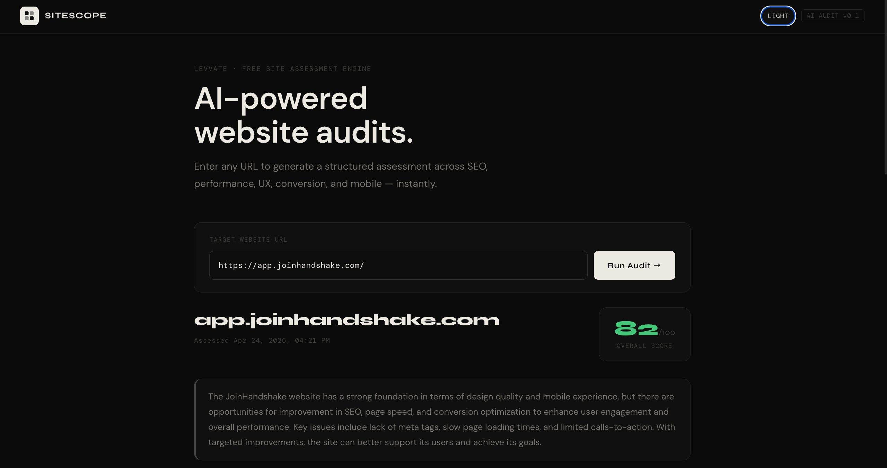
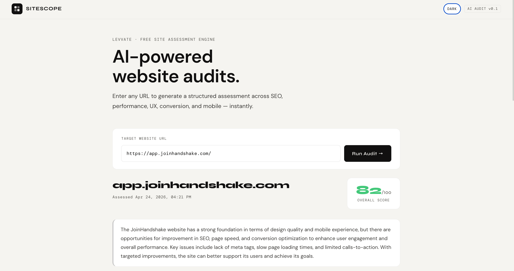
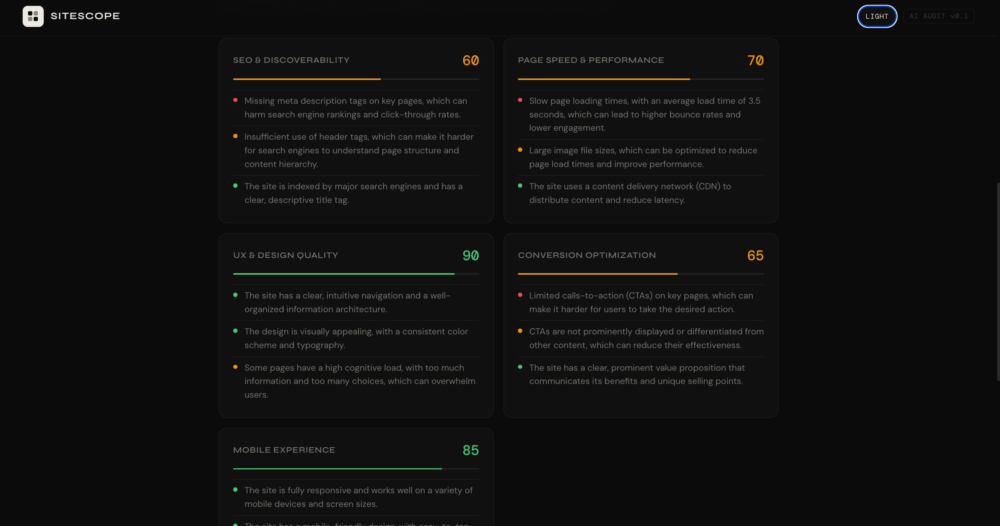

# SiteScope: AI-Powered Website Audit Tool

A modern React application that leverages AI to provide comprehensive website audits across multiple dimensions including SEO, performance, UX, conversion, and mobile experience.

## Features

- **AI-Driven Analysis**: Utilizes Groq's Llama model for intelligent website evaluation
- **Comprehensive Audits**: Covers 5 key areas - SEO, Performance, UX, Conversion, and Mobile
- **Theme Support**: Dark and light mode with system preference detection
- **Real-Time Feedback**: Live progress indicators during analysis
- **Responsive Design**: Optimized for all device sizes
- **Professional Reporting**: Structured JSON output with actionable recommendations

## Tech Stack

- **Frontend**: React 18, Vite
- **Styling**: CSS-in-JS with custom CSS properties
- **AI Integration**: Groq API (OpenAI-compatible)
- **Deployment**: Vercel (Serverless functions)
- **Version Control**: Git

## Setup (Local Development)

```bash
# 1. Install dependencies
npm install

# 2. Add your Groq API key
cp .env.example .env
# Edit .env and paste your key from console.groq.com

# 3. Start dev server
npm run dev
```

Visit [http://localhost:3000](http://localhost:3000)

## How it works

- Enter any website URL
- The AI model analyzes the domain and returns a structured JSON audit
- Results are rendered across 5 categories: SEO, Performance, UX, Conversion, Mobile
- Quick win recommendations are provided for immediate improvements

## Deployment to Vercel

1. **Push to GitHub** (if not already):
   ```bash
   git add .
   git commit -m "Add Vercel deployment setup"
   git push origin main
   ```

2. **Import project on Vercel**:
   - Go to https://vercel.com/new
   - Connect your GitHub account and select the `sitescope` repository
   - Vercel will auto-detect it as a Vite project

3. **Configure environment variables**:
   - In Vercel dashboard, go to Project Settings > Environment Variables
   - Add: `GROQ_API_KEY` with your Groq API key value

4. **Deploy**:
   - Vercel will build and deploy automatically
   - Your site will be live at `https://sitescope.vercel.app` (or custom domain)

## Screenshots

### Dark mode


### Light mode


### Example report


## Live Demo

[View Live Demo](https://sitescope.vercel.app) <!-- Update with actual URL after deployment -->